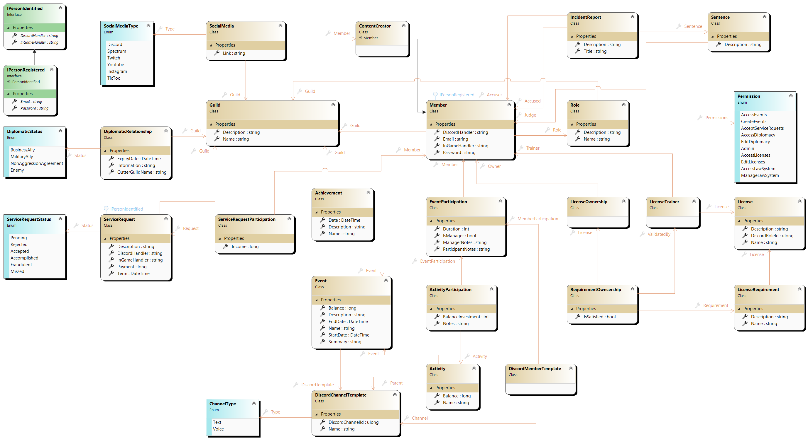
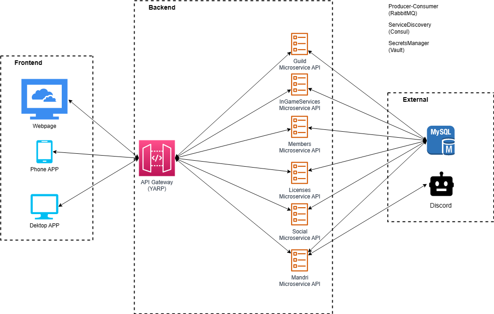

# GuildManagerSC

## Mission
This is a personal project I have decided to make altruistically for a gaming community of which I am a part, in collaboration with other members of the community which will develop other parts of the final product as the frontend or the cloud infrastructure in production. The mission is to have a final product that brings a webpage to our community that we can enjoy, speedup some community management tasks, bring new brand features to our daily gaming sessions as a community as well as a strong discord integration. Additionally this project will be my coding skills farming where I will experiment with new or less known technologies for me, therefore some of the design decissions will be taken accordingly with this premise rather than lookign for the fastest or efficent options.

## Technolgies and design patterns
**ASP.NET Core**, producer-consumer with **Rabbit MQ**, API Gateway with **YARP**, **CQRS** with **MediatR**, **EntityFramework** with **MySql**, secrets management with **Vault**, service registry with **Consul**, microservices with **Docker** and container orchestration, **DDD**, **CleanArchitecture**... These are just some examples of the many technologies and patters that will be used in this project.

## Formal description
The objective is to have a guild web page with a Discord server integrated, designed to manage the following aspects a StarCitizen guild: 

### Users
The webpage has to support multiple logged users with the respective LogIn and register features. To create an account the users will have to provide an in-game handler as well as a discord handler, an email and set up a password. The system will check if the provided discord handler exists and has joined the official guild Discord server and reacted accepting the rules message.
After this the system will connect to the official StarCitizen web page and verify the provided StarCitizen handle is a member of the guild. In this case the user will be considered as Member, otherwise it will be just a user(guest) without the internal guild sections for members. 
Finally the system will send a code via private message to the provided Discord handle and the webpage will wait for that code. Once the right code is provided the registration will be completed. If any error or requisite is not satisfied during the registration the user will be notified. Only successful registrations will be stored.

### Licenses
Guild members can Create, Update and Delete Licenses that will certify specific sets of in-game skills and allow “licensed” members to do certain activities.
Licenses will have a list of requisites that every member that wants to obtain the license will have to prove while playing with other members.

Members can enroll to be evaluated for a certain license and once the member will be certified with all required skills by the license, the member will automatically get the license.
When a member gets a license, automatically the system will assign him the respective role in Discord, so in every moment licenses in the webpage and the respective license roles in Discord are synchronized.

When a license is updated adding a new skill requirement, automatically all members will lose the license eventually until the new required skill is proved, then the license will be again automatically assigned to the member.

Members can create new Licenses that have to be approved by a minimum number of other members in order to be issued. Once the license is approved it can be issued, members can apply as candidates and the respective role in Discord is created.

### Guild Event History and Achievement History
The system will persist a history of all the events made by the guild with a start date, finish date, name and short description.
Also there will be a history of the relevant achievement made by the guild with information about the name, short description and date of the achievement as well as the guild members that participated.For security reasons only finished events will be displayed.

### SocialMedia
Some guild members can be also content creators and their content can be shown on the web page with the type of social media, description, links and giveaways or prizes they can offer. Additionally the guild can also have its own social media like discord or other. Registered users can subscribe to Discord newsletter and the Discord bot will notify them through private messages about any updates(i.e some streamer is online or some event guild was created). The user will have a list of topics to subscribe to.

### Events
Guild members can create and manage events at any time. Other members can join the event and the event creator can assign other members to be managers of the event(between the enrolled members) and help with the event management. Each event will require a template with the discord channels that will be used for the event and assign each enrolled member to one of the channel templates. Once the event will start, the system will create a new private category in Discord following the described channels template from the webpage that will be visible only to the enrolled members in the event. 

Discord templates will have a mandatory channel to interact with the system by two discord bot commands, one to “report for the service”, the second to “end the service”. This will register the assistance of a member to the event.The “report for the service” command will also automatically move the member to the associated channel according to the web template and measure the member participation in the event.

The end of the event will be triggered from the webpage by one of the event managers, and the dedicated discord channels will be deleted by a simple action from the webpage also performed by one of the event managers(only available after the event is marked as finished).

Every event will have a name, a summary, a detailed description, a start date and an estimated finish date. Also to support integration with discord every event will have a category template and the created category Id from Discord when the event is started. 

The user registration form to an event will contain an estimated join date and an estimated end date of the participation and a short text where the user can write notes to for example express preferences of the participation.

### Request Services
The webpage will have an in-game service request section where eligible users can request services to the guild fulfilling a form with a title and description of the required service as well as an in-game estimate payment. The form will also have a list of offered services from which the player can choose(the list will be defined by the guild managers), between the options there has to be an “Other” option.

The user has to select also a date for the service that is requesting or can also declare the service request is urgent and has to be as soon as possible. Once the form is sent, it is registered into the system and a message is sent to the discord server where members can accept the service request.

To be eligible for requesting services the user will have to provide an in-game handle, a Discord handle and have joined the guild’s discord server at the moment of sending the service request.

Additionally the user can also select how to be notified about the service request status updates, by default it will be through Discord thanks to the discord bot sending a private message to the user about the updates but the user can also choose to provide an email address to be notified by email instead. Finally the user can also select both options. Fraudulent service requests will mark the applicant as unreliable.

### Diplomacy
The guild’s webpage will have a Diplomacy section where all the current relationships with other guilds will be displayed. The user will be able to filter by the type of diplomatic status(like Economic Ally, Military Ally, Non-Aggression agreement, Enemy…).  Each diplomatic relationship will have a short description and the date when it was created. Additionally a diplomatic relationship can also have an Expiry date (i.e:Non-Aggression agreements).

### Justice
The webpage has to support an incident report system where guild members can report incidents with other members, the dedicated judge members will manage the reports and may create sentences from them in case it is pertinent. The first approach establishes that a guild member with 3 issued sentences will be kicked from the guild.

## Unified Domain Model (Class diagram)

For this project I have choose a Model first approach and for that purpose I have created a monolythic model of the whole application to have a clear and somple image of the domain model.

## Architecture

As far as this is a personal project I have decided to oversize the architechture to train, experiment and learn with some technologies, patterns and principles that are relatively new for me but I am interested in mastering them.

